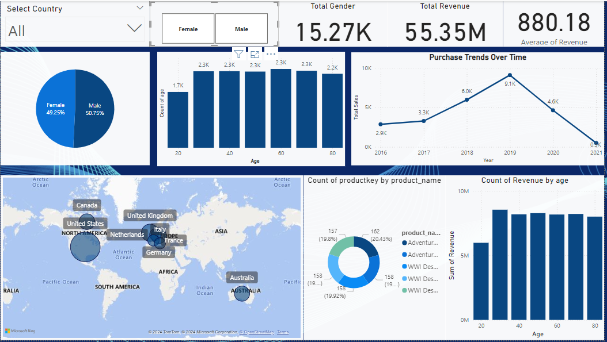
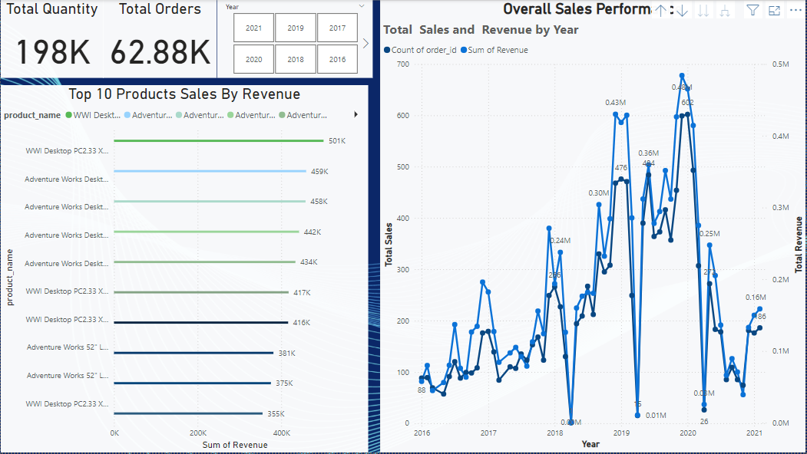
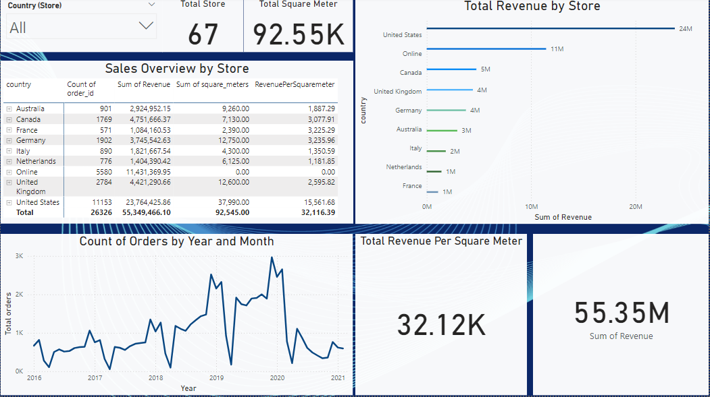
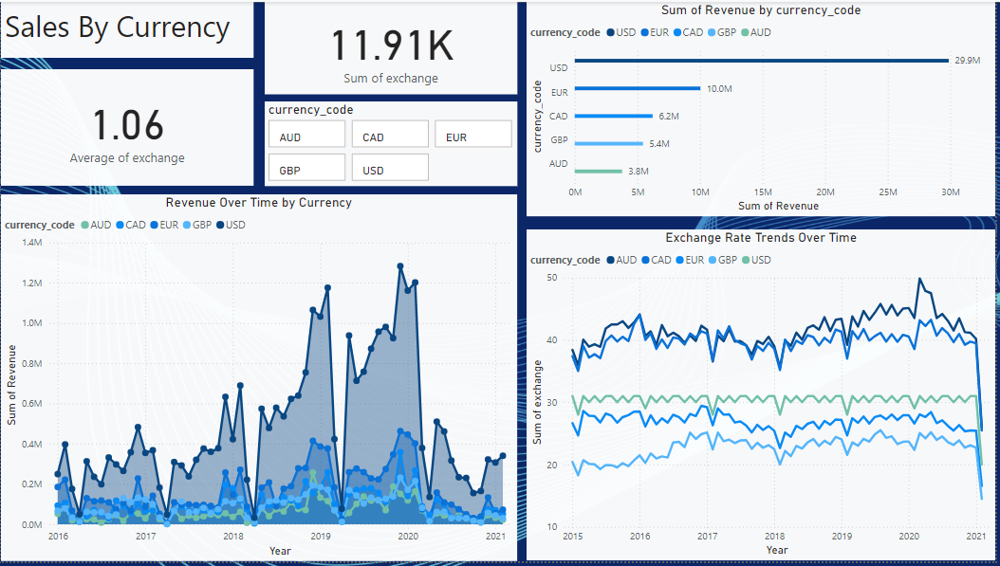
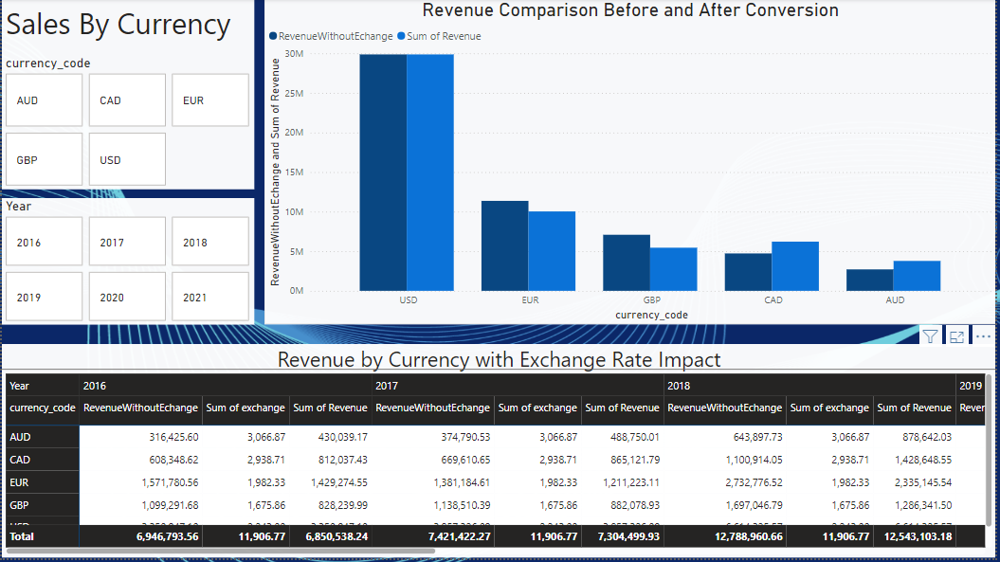
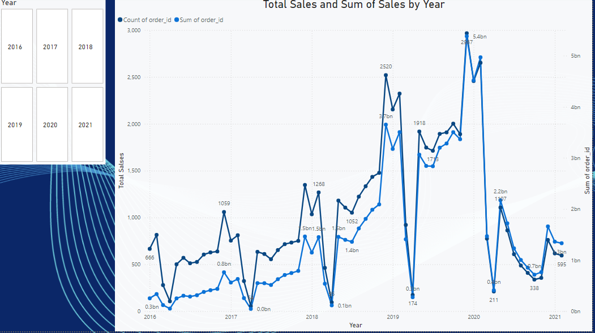
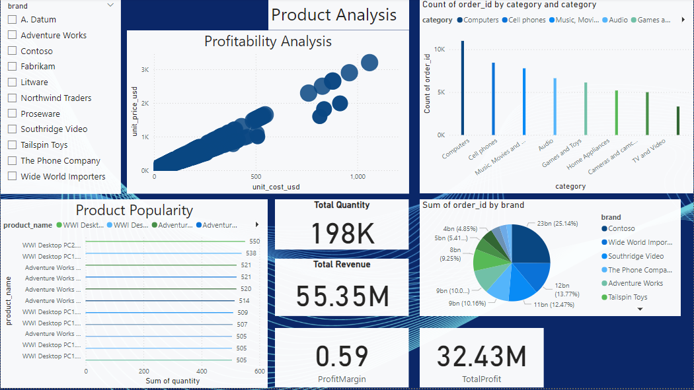
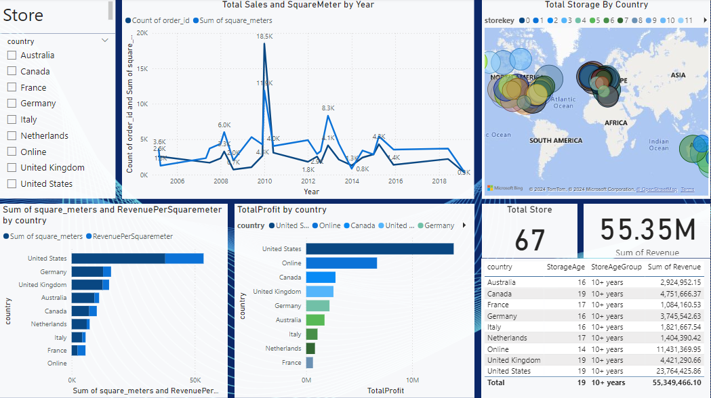

# Global Electronics Sales Analysis

## Overview

This project provides a comprehensive analysis of **Global Electronics** sales data, focusing on customer demographics, purchasing patterns, product performance, and store efficiency. The insights gained from this analysis help the business make informed decisions to improve sales, optimize inventory, and enhance customer satisfaction.

The project is organized around key areas:
1. **Customer Analysis**: Understanding customer demographics and behavior.
2. **Product Analysis**: Evaluating product popularity and profitability.
3. **Sales Trends**: Identifying seasonal and geographic trends in revenue.
4. **Store Analysis**: Analyzing store performance and efficiency.

### Key Insights
- **Customer Distribution**: The analysis reveals customer demographics by gender, age group, and location.
- **Top Products**: Identification of the most and least popular products by sales volume.
- **Profit Margins**: Calculated for each product to highlight profitable items.
- **Sales Trends**: Seasonality and sales by currency, including the impact of exchange rates.
- **Store Efficiency**: Revenue per square meter analysis to evaluate store performance.

### Technologies Used
- **Power BI**: Data visualization and dashboard creation.
- **SQL**: Data extraction and transformation.
- **DAX**: Data Analysis Expressions for calculated columns and measures.
- **Python (optional)**: For preprocessing data if necessary.

## Project Structure

```
├── Data/
│   ├── customer.csv          # Customer demographic data
│   ├── product.csv           # Product details and pricing
│   ├── sales.csv             # Sales transactions
│   ├── store.csv             # Store location and size data
│   └── exchange_rate.csv     # Exchange rates for currency conversion
├── PowerBI/
│   └── global_electronics.pbix  # Power BI dashboard file
├── SQL/
│   └── queries.sql           # SQL queries for data insights
├── Images/                   # Folder for screenshots of Power BI visuals
├── Data_preprocessing.ipynb  # EDA of global electronics
├── global_ele_schema.sql     # Schema for global electronics
├── streamlit_Q&A.py          # Streamlit app for query Q&A
└── README.md                 # Project documentation

```

## Getting Started

### Prerequisites
- Power BI Desktop
- SQL Server or MySQL (if running SQL queries independently)
- Basic knowledge of SQL and Power BI

### Setup Instructions

1. **Clone the Repository**
   ```bash
   git clone https://github.com/venumadhav2407/Illuminating_Insights_for_Global_Electronics.git
   cd Illuminating_Insights_for_Global_Electronics
   ```

2. **Load the Data into Power BI**
   - Open the `global_electronics.pbix` file in Power BI Desktop.
   - Use **Power Query** to load the datasets (`customer.csv`, `product.csv`, `sales.csv`, `store.csv`, and `exchange_rate.csv`) from the `Data/` folder.

3. **Set Up Relationships**
   - Ensure relationships are established between tables as follows:
     - `sales` to `customer`: Customer ID
     - `sales` to `product`: Product ID
     - `sales` to `store`: Store ID
     - `sales` to `exchange_rate`: Currency Code and Date

4. **Data Transformations and Calculated Columns**
   - Create calculated columns and measures as per analysis requirements. Example formulas:
     - **Total Revenue (USD)**: `SUMX(sales, sales[Quantity] * RELATED(product[Unit Price]) * LOOKUPVALUE(exchange_rate[exchange], exchange_rate[Currency Code], sales[Currency Code], exchange_rate[Date], sales[Order Date]))`
     - **Age Calculation**: `DATEDIFF(customer[birthday], TODAY(), YEAR)`
     - **Profit Margin**: `DIVIDE(SUM(product[unit_price_usd] - product[unit_cost_usd]), SUM(product[unit_price_usd]), 0)`

5. **Data Visualization**
   - Use **Power BI visuals** to represent key insights:
     - Customer demographics by age and gender (Bar and Pie charts)
     - Top-selling products (Bar chart)
     - Seasonal sales trends (Line chart)
     - Revenue by currency (Stacked bar chart with exchange rates)

6. **Deploy the Dashboard**
   - Once visuals are finalized, publish the dashboard to Power BI Service if you have access, for sharing and collaboration.


## Dashboard Screenshots

Include screenshots of key Power BI visuals:
- Customer Analysis
  
- Sales Analysis
  
  
  
  
  
- Product Analysis
  
- Store Analysis
  


## Recommendations

1. **Customer Targeting**: Focus on the most active age group for marketing.
2. **Product Portfolio**: Increase inventory for high-demand products and phase out low-sellers.
3. **Store Layout Optimization**: Improve store layout for higher revenue per square meter.
4. **Exchange Rate Management**: Monitor exchange rate fluctuations for pricing strategy.

## Conclusion

This analysis provides Global Electronics with valuable insights to refine their customer engagement strategies, improve product offerings, and optimize store performance. By implementing the recommendations, the company can drive higher sales and profitability across their operations.

